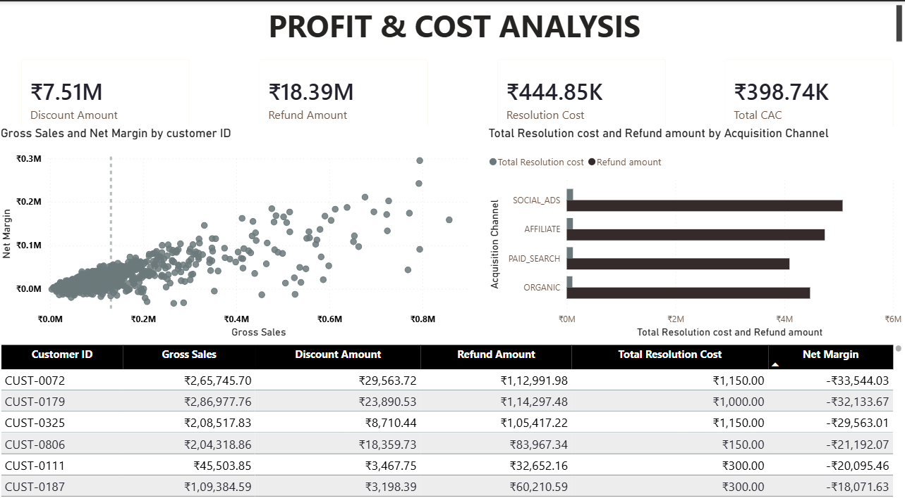
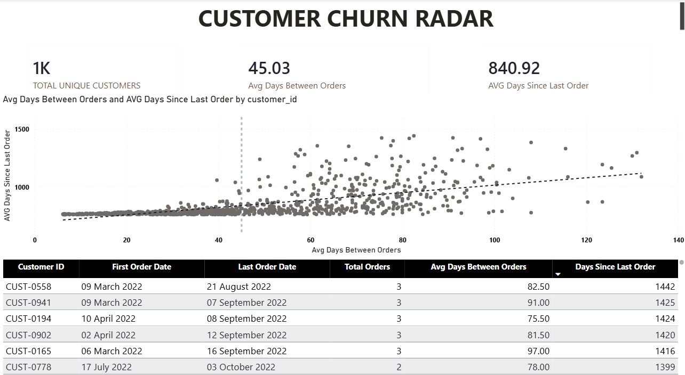
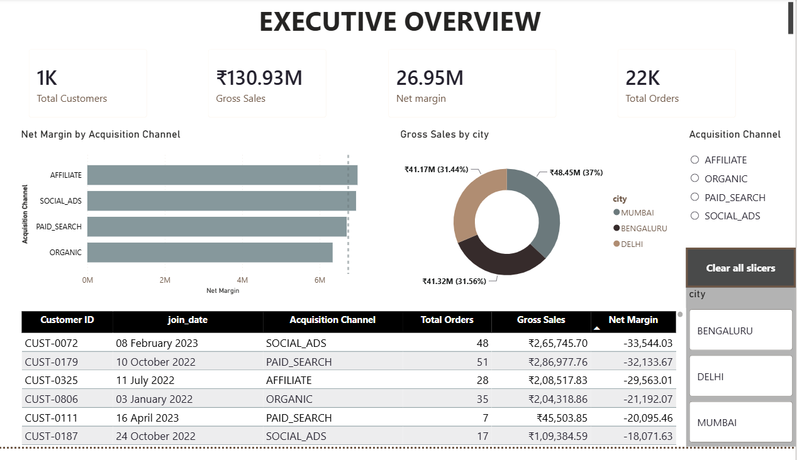

# 🚀 The Profit-Driven Retention Engine: Finding Hidden Revenue with Data 📊

> 📝 **Note:** This is a portfolio project built with sample e-commerce data. It demonstrates my ability to clean messy data, design defensive SQL data models, and translate database rows into commercial business value.

## 📌 The "Gross Sales" Trap (The Business Problem)
A growing e-commerce company had a dangerous blind spot: they measured success purely by **Gross Sales**. Because of this, leadership assumed customers who bought the most items were their top "VIPs."

However, Finance and Customer Service suspected a major issue. What if high return rates and customer support tickets meant the company was actually **losing money** on these top spenders?

Additionally, Marketing was relying on a generic "30-day rule" to guess when customers churned, missing out on highly personalized win-back campaigns. The company needed a single source of truth.

## 💡 From Siloed Data to Actionable Insights (What I Built)
I engineered a Google BigQuery data pipeline that extracted and combined siloed records from Sales, Products, Marketing, and Support. I cleaned the data, modeled it using strictly isolated SQL CTEs to prevent double-counting, and created a unified "Customer 360" Data Mart. Finally, I connected this model to Power BI to calculate actual profitability and predict customer churn.

---

## 📏 Core Metrics Engineered
To solve this problem, I moved away from vanity metrics and engineered three specific business rules:
* **True Profit:** `Gross Sales - Discounts - Refunds - COGS - CAC - Support Cost`
* **Fake VIP:** A customer with high gross revenue, but low (or negative) True Profit.
* **Silent Churn:** A customer who has statistically passed their historical, personal reorder gap (e.g., they normally buy every 15 days, but it has been 40 days).

---

## 🎯 Key Findings & Visual Proof

### 1. Exposing "Fake VIPs" & The ₹18.39M Blind Spot
By calculating True Profit, I found that some of the highest-spending customers are actually the company's biggest liabilities.

While leadership was focused on reducing Customer Support costs (₹444K total), my analysis proved that they were looking the wrong way. **Refunds (₹18.39M)** were the actual fire burning down the company's margins, heavily driven by the `SOCIAL_ADS` acquisition channel.

👇 **Visual Proof: The Profitability Radar**

*> Executive Insight: This scatter plot instantly identifies "Fake VIPs"—customers with high gross sales who drop below the ₹0 True Profit line.*
 

### 2. Shifting from Reactive to Proactive: "Silent Churn"
Instead of a generic 30-day rule, I utilized SQL window functions to calculate every customer's unique buying rhythm. I identified a massive cohort of users who had quietly missed their personal re-order dates, providing the Marketing team with an exact, targeted hit-list for win-back emails.

👇 **Visual Proof: The Silent Churn Radar**

*> Executive Insight: This flags customers who are significantly past their expected reorder date (data points floating dangerously above the safe trendline).*
 

### 3. The 5-Second Executive View
👇 **The Executive Overview**

*> Executive Insight: A clean, F-pattern summary of total customers, gross sales, true profit, and regional breakdowns designed for quick leadership consumption.*
 

---

## ⚡ Technical Note: Anchoring the Data
*Because this is a static portfolio dataset ending in April 2024, I intentionally hardcoded the "today" timestamp in my SQL to `2024-04-30` rather than using a live `CURRENT_DATE()` function. This prevents the dashboard from calculating artificially inflated, multi-year churn gaps, and accurately simulates a realistic, end-of-month executive report.*

---

## 🧠 What This Project Shows About Me
* **Commercial Awareness:** I don't just write SQL; I translate raw database rows into actionable concepts like *True Profit* and *Silent Churn*.
* **Defensive Data Modeling:** I use strictly isolated Common Table Expressions (CTEs) to aggregate data safely, intentionally preventing the "Fan-Out Trap" (accidentally double-counting revenue).
* **Data Governance & Cleaning:** I standardize messy geographic strings, deduplicate CRM glitches using `ROW_NUMBER()`, and use `COALESCE()` for safe math handling.
* **Dashboard Storytelling:** I build clean, F-pattern Power BI dashboards focused on answering business questions in 5 seconds, rather than cluttering the screen with flashy, confusing charts.

---

## 🛠️ The Data Pipeline Architecture
* **`01_staging_layer`:** 4 automated SQL views designed to clean and sanitize the data. This included fixing spelling variations, deduplicating CRM glitches, and intentionally flagging missing costs.
* **`02_MART`:** A robust SQL model (`mart_customer_360.sql`) that joins the cleaned tables into one flattened view optimized for Power BI, ensuring all financial math is accurate and ready for BI consumption.

---

## 📂 Repository Files
* **/assets**: Dashboard screenshots and architectural diagrams.
* **/01_staging_layer**: The SQL scripts used to clean, format, and fix the raw data.
* **/02_MART**: The Data Engineering SQL script that calculates True Profit and Custom Churn.
* **/03_Power BI_Dashboard**: The final Power BI `.pbix` file.